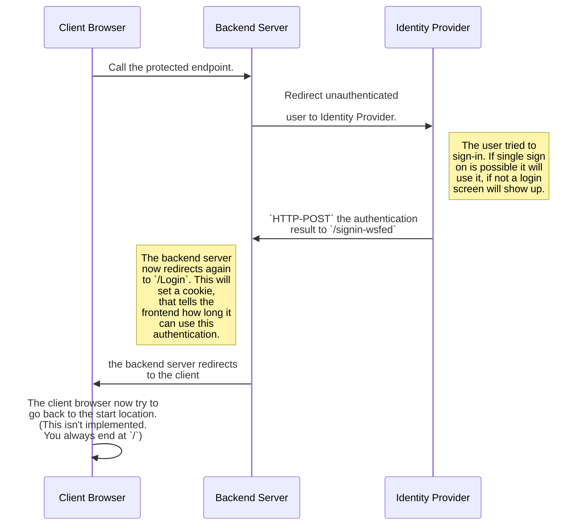

## People Soft backend

- [Login Backend](#login-backend)
  - [Build & Run](#build--run)
    - [Prequest](#prequest)
    - [Build](#build)
    - [Run](#run)
  - [Authentication flow](#authentication-flow)

> This document refers to the code in `Phonebook.Source.PeopleSoft`.

## Description

The People Soft backend is an api that connect to some People Soft views and provide an read only API for it. Currently it provides all data about the user, the organization structure and the building details.

## Connect the Backend to the ADFS or Azure

https://docs.microsoft.com/en-us/aspnet/core/security/authentication/ws-federation?view=aspnetcore-3.1

## Build & Run

### Prequest

To build and run the backend you need the **dotnet core SDK** installed in version 3.1 or higher. The latest version can be found [here](dot.net).
You also need VSCode. It's recommend to install the [C# Extension](https://marketplace.visualstudio.com/items?itemName=ms-vscode.csharp) from Microsoft. This helps with IntelliSense and live error checking. The use of [IntelliCode](https://marketplace.visualstudio.com/items?itemName=VisualStudioExptTeam.vscodeintellicode) is also recommended. This helps to write better code.

### Build

In VSCode simply run the task `build Source.PeopleSoft`. If you want to build this with the command line, you have to navigate to `Phonebook.Source.PeopleSoft` and run the command `dotnet build`.

### Run

Before you can run the login backend for the first time you have to set some secrets. These secrets describe the connection and the trust between the identity provider and the login server. (See more inside the [flow documentation](#authentication-flow))

| secret name                            | description                                                                                                                                 | sample                                                                                                                                                                                |
| -------------------------------------- | ------------------------------------------------------------------------------------------------------------------------------------------- | ------------------------------------------------------------------------------------------------------------------------------------------------------------------------------------- |
| `WsFederationConfig:MetadataAddress`   | This is the URL to the WsFederation metadata XML. In this document are all important properties that the identity provider defined          | In Azure AD it looks like this: `https://login.microsoftonline.com/{tenant-id}/federationmetadata/2007-06/federationmetadata.xml`                                                     |
| `WsFederationConfig:ApplicationId`     | The ApplicationId, also known as ClientId, in the Identity Provider. This makes the application definition in the Identity Provider unique. | 63d78047-cd41-4480-bd61-6ba21522503d                                                                                                                                                  |
| `WsFederationConfig:ClaimsIssuer`      | The Issuer that created the claim. For example for Azure it is `https://sts.windows.net/{tenant-id}/`                                       | `https://sts.windows.net/2f5af4bb-2ab0-4b54-87a0-9ce3ca95a9d0/`                                                                                                                       |
| `ConnectionStrings:PeopleSoftDatabase` | The connection to the people soft db                                                                                                        | `Data Source=(DESCRIPTION=(ADDRESS=(PROTOCOL=TCP)(HOST=dbserver.domain.de)(PORT=1521))(CONNECT_DATA=(SERVICE_NAME=servicename)));User Id=databaseuser;Password=databaseuserpassword;` |

> Information: If you aren't shure what you are doing please read [this document](https://docs.microsoft.com/aspnet/core/security/authentication/ws-federation?view=aspnetcore-3.1) first!

You can set secrets in the dictionary `Phonebook.Backend\Phonebook.Backend.Login` with the following command:

```bash
dotnet user-secrets set {name} {value}
```

After you have defined all secrets you can start the login backend in VSCode with the launch settings `Backend.Login .NET Core Launch (web)` or with the command line with `dotnet run` .

> Make sure that you are in the right folder for the command line stuff.

## Authentication flow


