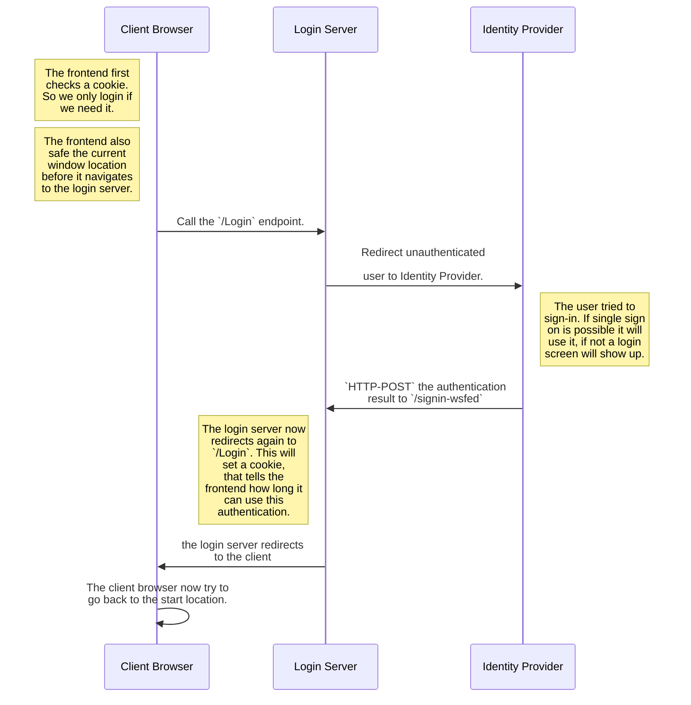

# Login Backend

- [Login Backend](#login-backend)
  - [Build & Run](#build--run)
    - [Prequest](#prequest)
    - [Build](#build)
    - [Run](#run)
  - [Authentication flow](#authentication-flow)

> This document refers to the code in `Phonebook.Backend\Phonebook.Backend.Login`

## Build & Run

### Prequest

To build and run the backend you need the **dotnet core SDK** installed in version 3.1 or higher. The latest version can be found [here](dot.net).
Also you need VSCode. I also recommend to install the [C# Extension](https://marketplace.visualstudio.com/items?itemName=ms-vscode.csharp) from Microsoft. This helps with IntelliSense and live error checking. Also I recommand the use of [IntelliCode](https://marketplace.visualstudio.com/items?itemName=VisualStudioExptTeam.vscodeintellicode), this helps to write better code.

### Build

In vscode simply run the task `build Backend.Login`. If you want build this with the command line you must navigate to the `Phonebook.Backend\Phonebook.Backend.Login` and run the command `dotnet build`.

### Run

Before you can run the login backend for the first time you have to set some secrets. These secrets describe the connection and the trust between the identity provider and the login server. (See more inside the [flow documentation](#authentication-flow))

| secret name                 | description                                                                                                                               | sample                                                                                                                          |
| --------------------------- | ----------------------------------------------------------------------------------------------------------------------------------------- | ------------------------------------------------------------------------------------------------------------------------------- |
| `wsfed:MetadataAddress`       | This is the URL to the WsFederation metadata XML. In this document are all important properties of the identity provider defined          | In Azure AD it looks like this: `https://login.microsoftonline.com/{tenant-id}/federationmetadata/2007-06/federationmetadata.xml` |
| `wsfed:ApplicationIdentifier` | The ApplicationId or also know as ClientId in the Identity Provider. This makes the appicaiton defintion in the Identity Provider unique. | 63d78047-cd41-4480-bd61-6ba21522503d                                                                                            |
| `wsfeed:FrontendProxyDomain`  | That is the domain, the authentication flow redirects after a successful authentication.                                                  | demo-phonebook.me                                                                                                               |

> Information: If you aren't shure what you are doing please read [this document](https://docs.microsoft.com/aspnet/core/security/authentication/ws-federation?view=aspnetcore-3.1) first!

You can set secrets with the following command, in the dictionary `Phonebook.Backend\Phonebook.Backend.Login`:

```bash
dotnet user-secrets set {name} {value}
```

After you have defined all secrets you can start the login backend in vscode with the launch settings `Backend.Login .NET Core Launch (web)` or on the command line with `dotnet run`. (make sure you are in the right folder for the command line stuff.)

## Authentication flow


