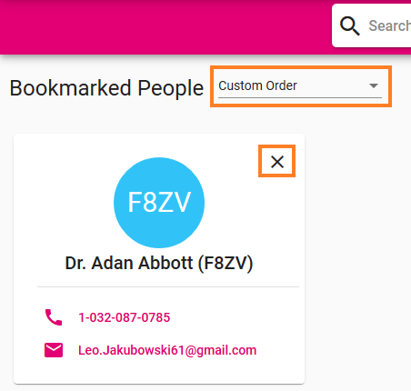
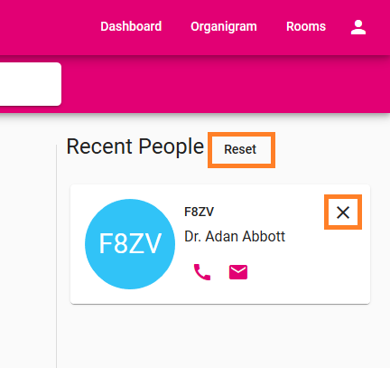

# :newspaper: Dashboard  

| Page Component                   | Content                                                                                                                                                                                                                                                                                                                                                                                                                                                                                     |
| -------------------------------- | ------------------------------------------------------------------------------------------------------------------------------------------------------------------------------------------------------------------------------------------------------------------------------------------------------------------------------------------------------------------------------------------------------------------------------------------------------------------------------------------- |
| **Search :mag_right:**           | To keep this guide clear and easy to read we wrote an [extra page](search) for the search function.                                                                                                                                                                                                                                                                                                                                                                                         |
| **Bookmarked People :bookmark:** | You can pin colleagues onto your dashboard by bookmarking them. This way you have their contact information right at your hand. If you need detailed information just open the profile. Either you use the order due to the time you bookmarked colleagues or you pick one of the other two options: alphabetically ascending or descending. Want to delete someone from this list? Just "X" them away.   |
| **Recent People :clock2:**       | In this section the Phonebook lists profiles you recently opened. To delete a single entry use the "X" on the contact card. You can also delete the whole list by clicking "Reset".                                                                                                                                                                                                                                              |

On the upper right of the dashboard you find four buttons to navigate within the subpages. Next to the Dashboard there are also [Organigram, Rooms and Profile Menu](subpages.md).
