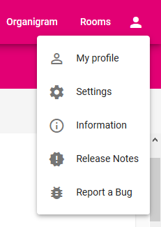

# Profile menu

When you open the profile menu you can navigate to further subpages. 
## My profile
This is were you can view the stored **information** about you. They will be displayed to other users when they open your profile. 

There's also the possibility to upload a **profile picture** as well as changing or deleting the current one. A profile picture facilitates recognizing you in the search. 

If the displayed information is wrong please contact XY. 

## Settings
You can switch the Phonebook from **English** to **German** with a single click.
To personalize your Phonebook you can also choose between four **design options**: a dark or light background and blue or magenta writings.

THE LAST FEATURE ISN'T IMPLEMENTED SO FAR 
## Information
This part of the Phonebook offers information about it seen as a **project**. You can find contact information for support requests and have the opportunity to participate as developer. We've also written a few words regarding cookies and licenses. 

## Release Notes
Surprise - this is the place for chronological ordered releases. 
## Report a Bug
You've found a bug or have suggestions for future developments? Please contact us! Either via **Azure** (THIS IS NOT AVAILABLE IN THE DEMO VERSION) or as issue directly in our **Github** project. 