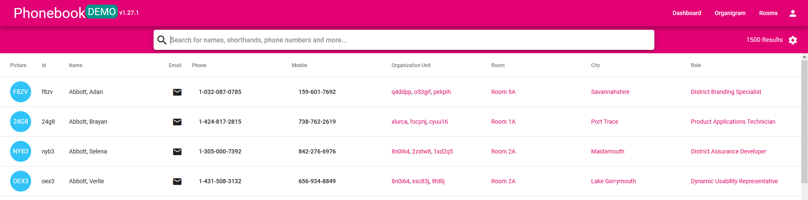
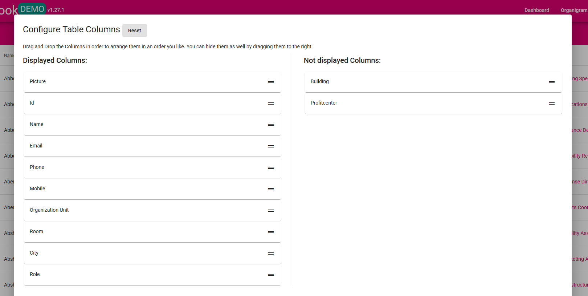
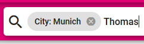

# :mag_right: Search
You can search for names, abbreviations, locations or departments. The search results display contact information your colleagues and details of their employment. 

To contact another user directly from the result list you click the  next to the name. This will open your email program. The same logic applies for **phone calls** after clicking the displayed number of a user. 

If you search for a unique name or abbreviation the search will open the relevant profile on its own. Otherwise you have to select the right entry from the result list. 

## :wrench: Configure search results
It is possible to reduce the search results by hiding selected attributes. Select   to open the table columns configuration. Use Drag & Drop to sort the attributes in "displayed" and "not displayed".

## :small_red_triangle_down: Filter
Every column of the result list can be used as a filter. To do so you need to type in the relevant attribute and define its value with ": value X". Confirm your filter with Enter and go on with typing your search request. 

Example: You want to find Thomas from Munich 

1.  
1. **Enter** 
1. 

When you've opened a profile - whether it's yours or another users - you can use all clickable attributes (bright colored) as filters, too. 

**Caution!** You can only use filters that are configurate as "displayed" in the filter settings (see above).
