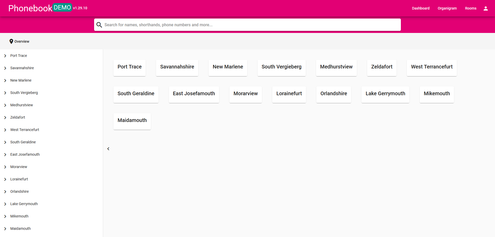
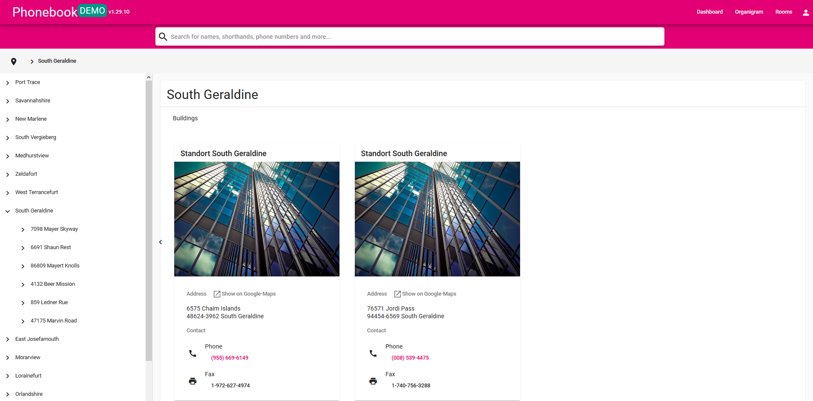
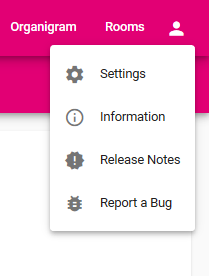

# :diamond_shape_with_a_dot_inside: Subpages
## :trident: Organigram 

This subpage offers you a visualization of our organizational structure. By scrolling down the page you find different work units which can be expanded by clicking on the arrow far to the right. 
## :door:  Rooms 
When you open the room subpage you can directly open our internal **booking tool** and check for available facilities as in Outlook. If this doesn't work, the function is disabled by your company

To find a specific room, you need to navigate either via the column at the left side or by clicking the buttons displayed in the middle. 

At the next deeper level you find **contact information** for the whole location you selected and the option to open it in **Google Maps**. 

If you go further you can select a **floor** and than a specific **room**.

## :open_file_folder: Profile menu
When you open the profile menu you can navigate to further subpages. 

  

| Subpage                                    | Content                                                                                                                                                                                                                                                                                                                                                                |
| ------------------------------------------ | ---------------------------------------------------------------------------------------------------------------------------------------------------------------------------------------------------------------------------------------------------------------------------------------------------------------------------------------------------------------------- |
| **My Profile :woman:**                     | This is were you can view the stored **information** about you. They will be displayed to other users when they open your profile. There's also the possibility to upload a **profile picture** as well as changing or deleting the current one. A profile picture facilitates recognizing you in the search. If the displayed information is wrong please contact your admin. |
| **Settings :gear:**                        | You can switch the language with a single click. To personalize your Phonebook you can also choose between several **design options**.                                                                                                                                            |
| **Information :information_source:**       | This part of the Phonebook offers information about it seen as a **project**. You can find contact information for support requests and have the opportunity to participate as developer. We've also written a few words regarding cookies and licenses.                                                                                                               |
| **Release Notes :heavy_exclamation_mark:** | Surprise - this is the place for chronological ordered releases.                                                                                                                                                                                                                                                                                                       |
| **Report a Bug :bug:**                     | You've found a bug or have suggestions for future developments? Please contact us! Please use an issue directly in our **GitHub** project.                                                                                                                                                                                                                             |