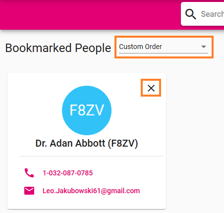

# User Guide
## :newspaper: Dashboard  

| Page Component | Content |
|----------------|---------|
|**Search :mag_right:**|   To keep this guide clear and easy to read we wrote an [extra page](search.pm) for the search function. |
|**Bookmarked People :bookmark:**|  You can pin colleagues onto your dashboard by bookmarking them. This way you have their contact information right at your hand. If you need detailed information just open the profile. Either you use the order due to the time you bookmarked colleagues or you pick one of the other two options: alphabetically ascending or descending. Want to delete someone from this list? Just "X" them away.  |
|**Recent People :clock2:**|In this section the Phonebook lists profiles you recently opened. To delete a single entry use the "X" on the contact card. You can also delete the whole list by clicking "Reset".|

## :trident: Organigram 

This subpage offers you a visualization of our organizational structure. By scrolling down the page you find different work units which can be expanded by clicking on the arrow far to the right. 
## :door:  Rooms 
When you open the room subpage you can directly open our internal **booking tool** and check for available facilities as in Outlook. 

To find a specific room, you need to navigate either via the column at the left side or by clicking the buttons displayed in the middle. 

At the next deeper level you find **contact information** for the whole location you selected and the option to open it in **Google Maps**. 

If you go further you can select a **floor** and than a specific **room**. 
## :open_file_folder: Profile menu
When you open the profile menu you can navigate to further subpages. 

  

| Subpage     | Content |
|---------------|---------|
|**My Profile :woman:**| This is were you can view the stored **information** about you. They will be displayed to other users when they open your profile. There's also the possibility to upload a **profile picture** as well as changing or deleting the current one. A profile picture facilitates recognizing you in the search. If the displayed information is wrong please contact XY.|
|**Settings :gear:**|You can switch the Phonebook from **English** to **German** with a single click.To personalize your Phonebook you can also choose between four **design options**: a dark or light background and blue or magenta writings.|
|**Information :information_source:**|This part of the Phonebook offers information about it seen as a **project**. You can find contact information for support requests and have the opportunity to participate as developer. We've also written a few words regarding cookies and licenses.|
|**Release Notes :heavy_exclamation_mark:** |Surprise - this is the place for chronological ordered releases.|
|**Report a Bug :bug:**| You've found a bug or have suggestions for future developments? Please contact us! Please use an issue directly in our **Github** project.|

